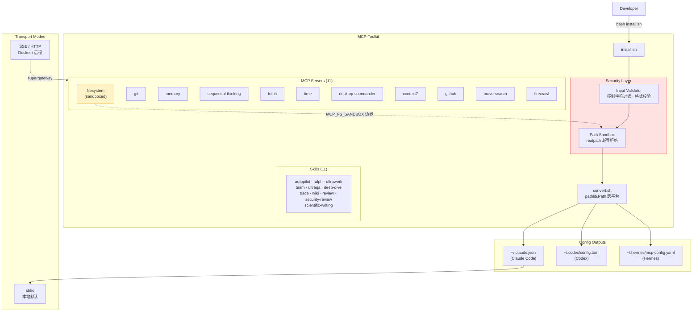

# MCP-Toolkit

**生产级 AI 工具包 — 11 MCP 服务器 · 11 技能 · 205 专家智能体**

**Production-grade AI toolkit — 11 MCP servers · 11 skills · 205 expert agents**

支持 Claude Code · Codex · Hermes · OpenClaw | Works with Claude Code · Codex · Hermes · OpenClaw

[](#安全性设计--security-design)
[](#平台兼容性--platform-compatibility)
[](#docker-快速启动--docker-quick-start)
[](LICENSE)

---

## 新版亮点 / What's New (v2)

| 特性 | 说明 |
|------|------|
| **路径沙盒** | 文件系统 MCP 服务器受限于 `MCP_FS_SANDBOX`，默认 `~/projects`，禁止越权访问 |
| **输入验证层** | API Key 格式校验 + 控制字符过滤，防止配置文件注入 |
| **跨平台路径处理** | Python 脚本全面采用 `pathlib.Path`，消除 Windows/Unix 路径分隔符差异 |
| **Docker 支持** | `Dockerfile` + `docker-compose.yml`，支持 stdio 安装和 SSE/HTTP 两种模式 |
| **`.env` 统一配置** | 所有密钥和路径通过单一 `.env` 文件管理，不再散落多处 |
| **TOML 注入防护** | 生成配置文件时对所有值进行转义，防止格式注入 |

---

## 架构图 / Architecture



---

## 快速开始 / Quick Start

### 方式一：本地安装（推荐）

```bash
git clone --recurse-submodules https://github.com/a976xw7td/MCP-Toolkit.git
cd MCP-Toolkit
cp .env.example .env          # 配置 API Key 和沙盒路径（见下方说明）
bash scripts/install.sh       # macOS / Linux / Windows Git Bash / WSL2
```

按提示选择 preset 即可，约 2 分钟完成安装。

### 方式二：Docker 安装（全平台通用）

```bash
git clone --recurse-submodules https://github.com/a976xw7td/MCP-Toolkit.git
cd MCP-Toolkit
cp .env.example .env          # 填写 API Key

# 运行安装器，写入宿主机的 ~/.claude 和 ~/.codex
docker compose run --rm install

# 以 SSE 模式运行 MCP 服务器（适合远程访问 / 团队共享）
docker compose up mcp-filesystem mcp-memory
```

---

## .env 配置说明

复制模板后编辑 `.env`：

```bash
cp .env.example .env
```

| 变量 | 说明 | 默认值 | 必需 |
|------|------|--------|------|
| `MCP_FS_SANDBOX` | 文件服务器沙盒路径（必须在 `$HOME` 内） | `~/projects` | 强烈推荐设置 |
| `GITHUB_PERSONAL_ACCESS_TOKEN` | GitHub PAT，scopes: repo, read:user | — | developer / full |
| `BRAVE_API_KEY` | Brave 搜索 API（免费层 2000次/月） | — | 可选 |
| `FIRECRAWL_API_KEY` | Firecrawl 爬虫 API（有免费层） | — | 可选 |
| `MCP_FILESYSTEM_PORT` | Docker SSE 模式端口 | `3001` | Docker 模式 |
| `PRESET` | Docker 安装时使用的 preset | `minimal` | Docker 模式 |

> **安全提示**：`.env` 已被 `.gitignore` 排除。请勿提交到版本库。

---

## 安全性设计 / Security Design

### 路径沙盒机制（Path Sandbox）

文件系统 MCP 服务器的访问范围受 `MCP_FS_SANDBOX` 严格限制：

1. **越界拒绝**：`install.sh` 使用 `os.path.realpath()` 展开所有符号链接后进行边界检查，任何超出 `$HOME` 的路径将终止安装。
2. **路径遍历防护**：规范化路径在符号链接展开后进行，`../../etc` 等遍历序列无法绕过沙盒。
3. **文件名安全**：复制 agent 文件时检查 basename，拒绝包含路径分隔符的恶意文件名。

```
MCP_FS_SANDBOX=~/projects          ✅ 允许（推荐）
MCP_FS_SANDBOX=~                   ✅ 允许（不推荐）
MCP_FS_SANDBOX=/etc                ❌ 拒绝（超出 $HOME）
MCP_FS_SANDBOX=~/../../etc         ❌ 拒绝（路径遍历）
MCP_FS_SANDBOX=~/link-to-etc       ❌ 拒绝（符号链接展开后超出 $HOME）
```

### 输入验证（Input Validation）

所有 API Key 在写入配置文件前经过两道过滤：

| 检查 | 实现 | 防护目标 |
|------|------|---------|
| 控制字符过滤 | `tr -d '[:cntrl:]'` | 嵌入式换行/null byte → TOML/JSON 注入 |
| 字符集校验 | `^[A-Za-z0-9_.\-]+$` | 特殊字符 → 配置格式破坏 |
| 长度检查 | 8–512 字符 | 异常长度 → 缓冲区问题 |
| TOML 转义 | `_toml_escape()` | 双引号/反斜杠 → TOML 格式注入 |

### HITL 建议（Human-in-the-Loop）

MCP 工具调用是自主行为，建议遵循以下审批原则：

| 操作类型 | 建议策略 |
|---------|---------|
| 文件读取（沙盒内） | 可自动批准 |
| 文件写入 / 删除 | 建议人工确认 |
| Shell 命令执行 | **必须人工确认** |
| 网络 POST/PUT 请求 | 建议人工确认 |
| Git Push / PR 创建 | **必须人工确认** |

在 Claude Code 中，将 `~/.claude.json` 中的 `tool_use_auto_approve` 设为 `false`（或不设置）可要求对每次工具调用进行交互确认。

### 安全声明（Security Policy）

- 如发现安全漏洞，请**不要**创建 public Issue，使用 GitHub [Private Security Advisory](https://docs.github.com/en/code-security/security-advisories/guidance-on-reporting-and-writing/privately-reporting-a-security-vulnerability)。
- `desktop-commander` 允许执行任意终端命令——这是设计行为，请在受信任环境中使用。
- API Key 以明文存储在 `~/.claude.json` 等配置文件中，建议确认文件权限为 `600`：
  ```bash
  chmod 600 ~/.claude.json ~/.codex/config.toml
  ```

---

## Docker 快速启动 / Docker Quick Start

### 一键安装模式（stdio）

```bash
# 构建镜像并运行安装器
docker compose run --rm install

# 指定 preset
PRESET=developer docker compose run --rm install
```

安装器会将配置写入宿主机的 `~/.claude`、`~/.codex` 等目录（通过 volume 映射）。

### SSE/HTTP 服务器模式

适合 Claude Desktop 远程配置、团队共享 MCP 服务器等场景。

```bash
# 启动文件服务器（端口 3001）
docker compose up mcp-filesystem

# 启动所有 SSE 服务器
docker compose up mcp-filesystem mcp-memory mcp-sequential-thinking mcp-context7
```

在 Claude Desktop 配置中添加远程服务器：

```json
{
  "mcpServers": {
    "filesystem-remote": {
      "url": "http://localhost:3001/sse"
    },
    "memory-remote": {
      "url": "http://localhost:3002/sse"
    }
  }
}
```

---

## 平台兼容性 / Platform Compatibility

### 安装脚本

| 系统 | 运行方式 | 状态 |
|------|---------|------|
| macOS | 直接运行 | ✅ 完全支持 |
| Linux | 直接运行 | ✅ 完全支持 |
| Windows（Git Bash） | Git Bash 中运行 | ✅ 支持 |
| Windows（WSL2） | WSL2 中运行 | ✅ 支持 |
| Windows（CMD/PowerShell） | 不支持 bash | ❌ 请用 Git Bash 或 WSL2 |
| 任意平台（Docker） | `docker compose run --rm install` | ✅ 全平台 |

> **Windows 用户**：安装 [Git for Windows](https://git-scm.com/download/win) 即可获得 Git Bash。

### Agent 兼容性

| Agent | macOS | Linux | Windows | 备注 |
|-------|-------|-------|---------|------|
| **Claude Code** | ✅ | ✅ | ✅ | 安装脚本需 Git Bash / WSL2 |
| **Codex** | ✅ | ✅ | ✅ | 安装脚本需 Git Bash / WSL2 |
| **Hermes** | ✅ | ✅ | ❌ | Hermes 本身不支持 Windows |
| **OpenClaw** | ✅ | ✅ | ✅ | 仅安装技能；不支持 205 专家角色 |

### 安装内容对照

| 内容 | Claude Code | Codex | Hermes | OpenClaw |
|------|:-----------:|:-----:|:------:|:--------:|
| 11 个技能 | ✅ | ✅ | ✅ | ✅ |
| MCP 服务器配置 | ✅ | ✅ | ✅ | ⚠️ 手动配置 |
| 205 个专家角色 | ✅ | ✅ | ✅ | ❌ 单 workspace 架构不支持 |

---

## 包含内容 / What's Included

### MCP 服务器（11 个）

| 服务器 | 功能 | 运行时 | API 密钥 |
|--------|------|--------|---------|
| filesystem | 沙盒化文件读写 | npx | 无需 |
| git | Git 操作 | uvx | 无需 |
| memory | 跨会话知识图谱 | npx | 无需 |
| sequential-thinking | 结构化推理链 | npx | 无需 |
| fetch | 网页内容抓取 | uvx | 无需 |
| time | 时区/时间转换 | uvx | 无需 |
| desktop-commander | 终端控制与进程管理 | npx | 无需 |
| context7 | 实时库文档注入 | npx | 无需 |
| github | GitHub 全量 API | npx | GitHub PAT |
| brave-search | 网络搜索（免费层） | npx | Brave API |
| firecrawl | 深度网页爬取（免费层） | npx | Firecrawl API |

### 技能（11 个）

| 技能 | 描述 |
|------|------|
| autopilot | 自动驾驶 — 给目标，自动规划并执行 |
| ralph | 持久重试 — 循环直到任务完成且验证通过 |
| ultrawork | 超深工作模式 — 多轮分析，最高质量输出 |
| team | 多智能体协作 — N 个工作者并行执行 |
| ultraqa | 全面质量审查 — 功能、回归、安全、可访问性 |
| deep-dive | 深度代码分析 — 从第一性原理理解系统架构 |
| trace | 根因分析 — 追踪 bug 到具体源头 |
| wiki | 文档生成 — README、API 文档、架构文档 |
| scientific-writing | 学术写作助手 — 论文、报告、文献综述 |
| review | 代码审查 — 正确性、性能、安全、可维护性 |
| security-review | 安全审计 — OWASP Top 10 全覆盖 |

### 专家智能体（205 个）

来自 [agency-agents](https://github.com/msitarzewski/agency-agents)，涵盖：

工程 · 设计 · 营销 · 销售 · 金融 · 产品 · 测试 · 游戏开发 · 安全 · 学术 · 更多

安装后位于 `~/.claude/agents/`（Claude Code）和 `~/.codex/rules/`（Codex）。

---

## 前置依赖 / Requirements

| 依赖 | 用途 | 安装 |
|------|------|------|
| Node.js 18+ | 运行 npx 类 MCP 服务器 | https://nodejs.org |
| uv | 运行 uvx 类服务器（git/fetch/time） | `curl -LsSf https://astral.sh/uv/install.sh \| sh` |
| Python 3.8+ | 安装脚本内部 | 通常已预装 |
| git | 克隆仓库（含 submodule） | https://git-scm.com |
| Docker（可选） | Docker 模式安装 | https://docs.docker.com/get-docker/ |

---

## 预设方案 / Presets

### minimal（推荐新手）
- 无需任何 API 密钥
- 8 个 MCP 服务器：filesystem、git、memory、sequential-thinking、fetch、time、desktop-commander、context7

### developer（推荐开发者）
- 需要免费 GitHub Personal Access Token（scopes: repo, read:user）
- 10 个服务器：+ github、brave-search
- Token 获取：https://github.com/settings/tokens

### full（全功能）
- 需要 GitHub PAT
- 可选 Brave Search API + Firecrawl API（均有免费层）
- 全部 11 个服务器

---

## 安装后能做什么 / What You Can Do After Install

```bash
# 自动规划并执行任务
autopilot: 帮我建一个有登录功能的 React 项目

# 多智能体并行开发
/team 4:executor "实现用户管理 CRUD API 和测试"

# 代码审查
review the authentication module

# 安全审计
security-review src/api/

# 深度代码理解
deep-dive 支付处理模块是怎么工作的

# 激活专家角色
用 Backend Architect 帮我设计数据库结构
用 UI Designer 帮我生成 HTML 报告模板
```

---

## 手动安装 / Manual Install

```bash
# 生成集成文件
bash scripts/convert.sh minimal

# Claude Code
cp -r integrations/claude-code/skills/* ~/.claude/skills/
find agents -name "*.md" ! -path "*/integrations/*" ! -path "*README*" \
  ! -path "*/strategy/*" ! -path "*/scripts/*" \
  -exec cp {} ~/.claude/agents/ \;
# 将 integrations/claude-code/mcp-config.json 内容合并到 ~/.claude.json

# Codex
cp -r integrations/codex/skills/* ~/.codex/skills/
# 将 integrations/codex/mcp-config.toml 追加到 ~/.codex/config.toml
```

---

## 贡献 / Contributing

欢迎提交 PR！新增 MCP 服务器请在 `mcp/servers/` 下添加 YAML 配置文件，格式参考现有文件。

PRs welcome! To add a new MCP server, add a YAML config in `mcp/servers/`.

---

## 许可证 / License

MIT

---

*agency-agents submodule © [msitarzewski/agency-agents](https://github.com/msitarzewski/agency-agents)*
